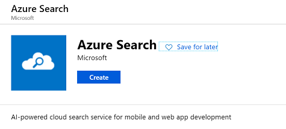
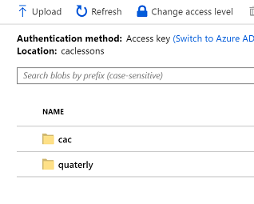

# Structured and Unstructured Docs in Azure Search

To provide uniform search capabilities across both  - structured (Azure SQL) and unstructured (Azure Blob) documents we need to combine indexed data in a single searchable index.


## Create Azure resources
 Create Azure Search


 and Cognitive service


## Index Schema
Prepare a schema that would be populated by indexers, we will use postman to send th REST API call

- Import Postman collection/environment  (refer to details in `Search Index Creation` folder)
- Create  index by sending POST API request `CreateIndex`

- Fiedls created by Json definition contain fields that will be populated by indexer from SQL (e.g Event_Type, Source etc), from Blob data (content_type etc), by cognitive services skills ( locations, keyphrases, organizations) and by custom skill (EventType)


** Index Key ** filed `ID` is populated by both indexers and should be unique across both, sql populates it with PRIMARY KEY and Blob with unique path to the blob file.

## Scoring Profile
Part of the index definition is also Scoring Profiles helping to boost keyphrases, project name and most recent high ranking records. 

```
 "scoringProfiles": [  
	    {  
	      "name": "boostKeys",  
	      "text": {  
	        "weights": {  
	          "keyphrases": 1.5,  
	          "Project_Name": 5  
	        }  
	      }  
	    },  
	    {  
	      "name": "newAndHighlyRated",  
	      "functions": [  
	        {  
	          "type": "freshness",  
	          "fieldName": "LessonDate",  
	          "boost": 10,  
	          "interpolation": "quadratic",  
	          "freshness": {  
	            "boostingDuration": "P365D"  
	          }  
	        },  
	        {
	          "type": "magnitude",  
	          "fieldName": "rating",  
	          "boost": 10,  
	          "interpolation": "linear",  
	          "magnitude": {  
	            "boostingRangeStart": 1,  
	            "boostingRangeEnd": 5,  
	            "constantBoostBeyondRange": false  
	          }  
	        }  
	      ]  
	    }  
     ]
```

## DataSources
Prepare SQL and Blob data (refer to the sections below) and define Blob and SQL DataSources using Rest API

For SQL DataSource enable change tracking fo the table to be sure  Indexer only indexes updated fields:
```
 {
            "name": "sharepointexport",
            "description": "source for excel parsed data",
            "type": "azuresql",
            "subtype": null,
            "credentials": {
                "connectionString": "{{sqlConnectionUrl}};"
            },
            "container": {
                "name": "[Lessons$]"
            },
            "dataChangeDetectionPolicy": {"@odata.type" : "#Microsoft.Azure.Search.SqlIntegratedChangeTrackingPolicy"},
            "dataDeletionDetectionPolicy": null
}
```

## Indexer setup
Now we will define how indexers will process data and populate index. Create Skillsets prior to creating indexers if they use them like in our example.

## BlobIndexer
Refer to `CreateBlobIndexer` example in postman collection, it maps fields typically extracted by BlobIndexer to the schema we defined using `fieldMappings` :

```
     "fieldMappings": [
                {
                    "sourceFieldName": "metadata_storage_path",
                    "targetFieldName": "ID",
                    "mappingFunction": {
                        "name": "base64Encode",
                        "parameters": null
                    }
                },
                {
                    "sourceFieldName": "metadata_storage_path",
                    "targetFieldName": "metadata_storage_path",
                    "mappingFunction": null
                },
                {
                    "sourceFieldName": "metadata_storage_path",
                    "targetFieldName": "Source",
                    "mappingFunction" : { "name" : "extractTokenAtPosition", "parameters" : { "delimiter" : "/", "position" : 4 } }
                },
                {
                	
                    "sourceFieldName": "metadata_last_modified",
                    "targetFieldName": "LessonDate",
                    "mappingFunction": null
                },
                {
                	
                    "sourceFieldName": "metadata_content_type",
                    "targetFieldName": "content_type",
                    "mappingFunction": null
                },
                {
                	
                    "sourceFieldName": "Project_Name",
                    "targetFieldName": "Project_Name",
                    "mappingFunction": null
                }
     ]
```
it' important to have ID mapped to uniquely identified field, and we map also fields with similar meaning with sql data. 
In this example above we also extract part of the Path in the blob container to serve as `Source` field data.
And we map the custom `Project_Name` metadata from blob record to the index as well.

so that example Blob below will get it's all firelds extracted


Indexer also defines how to map fields extracted by cognitive skillset we are using with it.
```
{
            
            "name": "blobtosqlindexer",
            "description": "combined indexer",
            "dataSourceName": "cac-items",
            "skillsetName": "cogniskillset",
            "targetIndexName": "lessons-index",
            "outputFieldMappings": [
                {
                    "sourceFieldName": "/document/merged_content/organizations",
                    "targetFieldName": "organizations",
                    "mappingFunction": null
                },
                {
                    "sourceFieldName": "/document/merged_content/locations",
                    "targetFieldName": "locations",
                    "mappingFunction": null
                },
                {
                    "sourceFieldName": "/document/merged_content/keyphrases",
                    "targetFieldName": "keyphrases",
                    "mappingFunction": null
                }
            ]
}
```

## SQLIndexer
Refer to `CreateSqlIndexer` example in postman collection, it maps fields extracted by SqlIndexer to the schema we defined using `fieldMappings` :

```
 {
           
            "name": "sqldata-indexer",
            "description": "opt",
            "dataSourceName": "sharepointexport",
            "skillsetName": "sqlstoreskillset",
            "targetIndexName": "lessons-index",
            "disabled": null,
            "schedule": null,
            "parameters": {
                "batchSize": null,
                "maxFailedItems": null,
                "maxFailedItemsPerBatch": null,
                "base64EncodeKeys": false,
                "configuration": {}
            },
            "fieldMappings": [
            	 {
                    "sourceFieldName": "Lesson_Learned_Comment",
                    "targetFieldName": "content",
                    "mappingFunction": null
                }
            ],
            "outputFieldMappings": [
                {
                    "sourceFieldName": "/document/content/locations",
                    "targetFieldName": "locations",
                    "mappingFunction": null
                },
                {
                    "sourceFieldName": "/document/content/organizations",
                    "targetFieldName": "organizations",
                    "mappingFunction": null
                },
                {
                    "sourceFieldName": "/document/content/keyphrases",
                    "targetFieldName": "keyphrases",
                    "mappingFunction": null
                },
                {
                    "sourceFieldName": "/document/EventType",
                    "targetFieldName": "EventType",
                    "mappingFunction": null
                }
            ]
        }
```
Once indexers created they start process of indexing and populating the search data.


## Custom Skillset
In our example `CreateSkillset` we have created a skillset that uses cognitive services to extract data, skill to store extracted data in knowledge store and custom skill that maps various entries of `Event_Type` to only two possible values in the new field `EventType`
Our custom skill is hosted in Azure Function and here we define what data will be paased to the skill and what is output:
```
{
"@odata.type": "#Microsoft.Skills.Custom.WebApiSkill",
"description": "Our new OPS Mapping Event Type custom skill",
"uri": "{{funcUrl}}",
"batchSize": 100,
"context": "/document",
"inputs": [
    {
        "name": "Event_Type",
        "source": "/document/Event_Type"
    }
    ],
    "outputs": [
    {
        "name": "eventType",
        "targetName": "EventType"
    }
    ]
}
```

Note that when we will create Indexer it will define in `outputMappings` that `EventType` field coming from custom skill will be mapped to Indexed field.

Publish Custom Skill to Azure Function and test it using `TestFuncSkill`


You could see the data processes in Function Logs:


## Web Application
To provide web application access to search index and ability to retrive the documents we could use ReactJS library [AzSearch.js](https://github.com/Yahnoosh/AzSearch.js) and it's corresponding [Web application generator](http://azsearchstore.azurewebsites.net/azsearchgenerator/index.html)

You could see the generated and adjusted sample in the `WebApp` directory.

- modify `index.html` with names of facets in html controls that will be bound to the selections

``` html
 <div id="facetPanel" class="col-sm-3 col-md-3 sidebar collapse">
    <div id="facetHeader"></div>
    <ul class="nav nav-sidebar">
        <div className="panel panel-primary behclick-panel">           
            <li>
                <div id="Project_NameFacet">
                </div>
            </li>
            <li>
                <div id="EventTypeFacet">
                </div>
            </li>
            .....
            
            <li>
                <div id="LessonDateFacet">
                </div>
            </li>
                                        
        </div>
    </ul>
    <div id="facetFooter"></div>
</div>
```
- modify `src\index.js` to connect to the search index created before
```
var automagic = new AzSearch.Automagic({ index: "lessons-index", queryKey: "xxxxx", service: "testindexeneros" });
```

- and connect React controls to the html elements in `index.js`, for example facets are defined like this connecting html control name and actual field in search index:
```
// Add a loading indicator above the results view
automagic.addLoadingIndicator("loading");
// Adds a pager control << 1 2 3 ... >>
automagic.addPager("pager");
automagic.addCheckboxFacet("Project_NameFacet", "Project_Name", "string");
automagic.addCheckboxFacet("EventTypeFacet", "EventType", "string");
automagic.addCheckboxFacet("SourceFacet", "Source", "string");
automagic.addCheckboxFacet("Lessons_Learned_CategoryFacet", "Lessons_Learned_Category", "string");
automagic.addCheckboxFacet("Project_TypeFacet", "Project_Type", "string");
``` 

- To customze how results and suggestions are displayed you can use Moustache templates, that could use fields from index, and you could specify tags used for highlighting

```
    var resultTemplate =
    `
        <div class="col-xs-12 col-sm-9 col-md-9">
            <h4>{{{Project_Name}}}</h4>
            
            <div class="resultDescription">
                {{{summary}}}
            </div>
            <ul class="resultProperties">
                <li class="resultProperties__date">Date: <span>{{dateChanged}}</span></li>
                <li class="resultProperties__score">Score: <span>{{score}}</span></li>
                <li class="resultProperties__type">Type: <span>{{contentType}}</span></li>
                <li class="resultProperties__source">Source: <span>{{Source}}</span></li>
            </ul>
        </div>`;
        // add a results view using the template defined above
        automagic.addResults("results", {
                         count: true, 
                         highlight: "Project_Name, content", 
                         highlightPreTag:  "<mark><em>",
                         highlightPostTag: "</em></mark>"
                        }, 
                     resultTemplate);
```
- To format reulsts prior to displaying then in template we can define `resultsProcessor`, that could extract and format data fields, in our example below we prepare summary for each result record to be constructed only from sentences that include highlights and not entire content, and we are formatting Date, Score and ContentType to be more user friendly. 

```
 var resultsProcessor = function (results) {
        return results.map(function (result) {
            
            var summary = result.content;

            // replace values with highlights
            var highlights= result["@search.highlights"]
            if (highlights!==undefined) {
                if ( 'Project_Name' in highlights )
                    result.Project_Name = highlights.Project_Name[0];
                if ( 'content' in highlights )
                    summary = highlights.content[0];
            }
            
            result.summary = summary.length < 400 ? summary : summary.substring(0, 400) + "...";
            
            // format Date
            var dateChanged = new Date(result.LessonDate);
            result.dateChanged = dateChanged.toLocaleDateString(undefined, {
                day: '2-digit',
                month: '2-digit',
                year: 'numeric'
            });

            // format score
            result.score = numeral(result["@search.score"]).format("0.00");

            // format type
            result.contentType = getContentTypeShort(result.content_type);
            return result;
        });
    };
    automagic.store.setResultsProcessor(resultsProcessor);
```

Similar process is used for suggestion box customizations, more details on capabilities could be found at [AzSearch.js](https://github.com/Yahnoosh/AzSearch.js)

## WebApp Hosting
To host webapp use [Azure Storage for Static websites](https://docs.microsoft.com/en-us/azure/storage/blobs/storage-blob-static-website-how-to) Feature. Once enables on Storage account you would see `$web` container that will be used for hosting artifacts.

Use Visual studio Code to upload the files - for tutorial refer to [VSCode Deploy to Azure Storage](https://code.visualstudio.com/tutorials/static-website/deploy-website)

## SQL data preparation
To import structured data from Excel  create Azure SQL database and create a table with all the fields coming from excel columns and add `IDENTITY` column that would searve as unique key for the index

```
CREATE TABLE [dbo].[Lessons$] (
ID int IDENTITY(1, 1) PRIMARY KEY,
[Project_Name] nvarchar(255),
[Line_Of_Business] nvarchar(255),
[PM_Phase] nvarchar(255),
[Event_Type] nvarchar(255),
[Lessons_Learned_Category] nvarchar(255),
[Lesson_Learned_Comment] nvarchar(max),
[Project_Type] nvarchar(255),
[Source] nvarchar(255),
[LessonDate] datetime
)
```
And Enable Change tracking as defined in [Enable Change TRacking in SQL Server](https://docs.microsoft.com/en-us/SQL/relational-databases/track-changes/enable-and-disable-change-tracking-sql-server?view=sql-server-2017)
```
ALTER DATABASE datasearch  
SET CHANGE_TRACKING = ON  
(CHANGE_RETENTION = 2 DAYS, AUTO_CLEANUP = ON)  
  

ALTER TABLE [dbo].[Lessons$] 
ENABLE CHANGE_TRACKING  
WITH (TRACK_COLUMNS_UPDATED = ON)  
```

Use `Tasks-> Import Data` wizard to import excel data, choose `Microsoft Excel` as input datasource
 

and OLEDB provider for SQL server as destination

 

Verify all the mappings


## Blob Data Preparation
Create Azure Storage account and Blob cotainer, upload  documents in two folders based on their Source.


# References

- [Scoring Profiles](https://docs.microsoft.com/en-us/azure/search/index-add-scoring-profiles)
- [Azure Search REST](https://docs.microsoft.com/en-us/rest/api/searchservice/index)
- [Azure Search Analyzers](https://github.com/endintiers/AzureSearch-AnalyzerDemo-Alice)
- [Azure Blob Indexer](https://docs.microsoft.com/en-us/azure/search/search-howto-indexing-azure-blob-storage)
- [Combining Data in Azure Search](https://cmatskas.com/combining-data-from-multiple-sources-in-azure-search/)
- [Custom Skill Template](https://github.com/Azure-Samples/azure-search-knowledge-mining/blob/master/03%20-%20Data%20Science%20and%20Custom%20Skills/Azure%20Function%20Custom%20Skills/0_CustomSkillTemplate.cs)
- [Create Custom Skill](https://docs.microsoft.com/en-us/azure/search/cognitive-search-create-custom-skill-example)
- [Saerch Documents](https://docs.microsoft.com/en-us/rest/api/searchservice/search-documents)
- [Saerch Sample](https://github.com/Azure-Samples/search-dotnet-asp-net-mvc-jobs)
- [Doc Based bot](https://docbasedbot-test.cloudapp.net/Home/Index)
- [AzSearch.js](https://github.com/Yahnoosh/AzSearch.js)
- [AzSearch Web application generator](http://azsearchstore.azurewebsites.net/azsearchgenerator/index.html)
