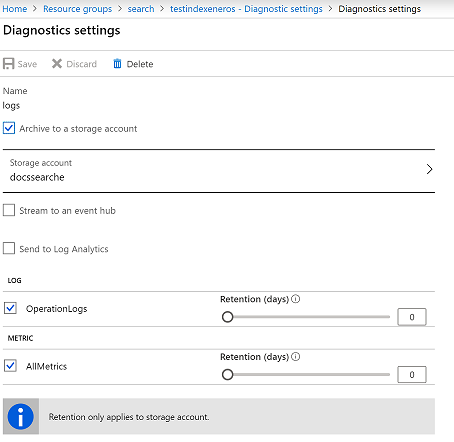

# Reporting

## PowerBI on data from App Insights and Knowledge Store
Reporting contains optional pre-built PowerBI reports that can be used to monitor your solution and to understand user search behavior. They leverage data captured via Application Insights and extended to use Knowledge Store and can be modified to meet your particular business objectives.

For details on enabling Azure Search Analytics refer to the [docs](https://docs.microsoft.com/en-us/azure/search/search-traffic-analytics)

Original report and instructions could be found in azure knowledge mining accelerator github [Reporting Module](https://github.com/Azure-Samples/azure-search-knowledge-mining/tree/master/04%20-%20Reporting)

This extended version includs sample connection and word cloud from Knowledge Store

- Open `Cognitive Search and KS` report in PowerBI Desktop and provide connection details for AI and Storage Account 

It will show the data being retrieved from relevant data sources

- The views in report will provide metrics based on the Custom Events in App Insights and Knowlege Store

For more details on Knowledge Store:

[Intro to Knowledge Store](https://docs.microsoft.com/en-us/azure/search/knowledge-store-concept-intro)

[Connect Power BI to Knowledge Store](https://docs.microsoft.com/en-us/azure/search/knowledge-store-connect-power-bi)

## PowerBI on data from Search Service Diagnostics
For details on Azure Search Analytics refer to blog details  [Analyzing Azure Search Traffic](https://azure.microsoft.com/is-is/blog/analyzing-your-azure-search-traffic/) and MS docs at [POwerBI connect to Azure Search Metrics](https://docs.microsoft.com/en-us/power-bi/service-connect-to-azure-search)

To enable metrics reports - enable `Diagnostics` for search service to go into Storage account

It gets two new containers with metrics data into storage account

Once you have imported the Azure Search solution into PowerBi workspace (in powerbi.com), you would have access to dashboard and reports created on top of the metrics data:

