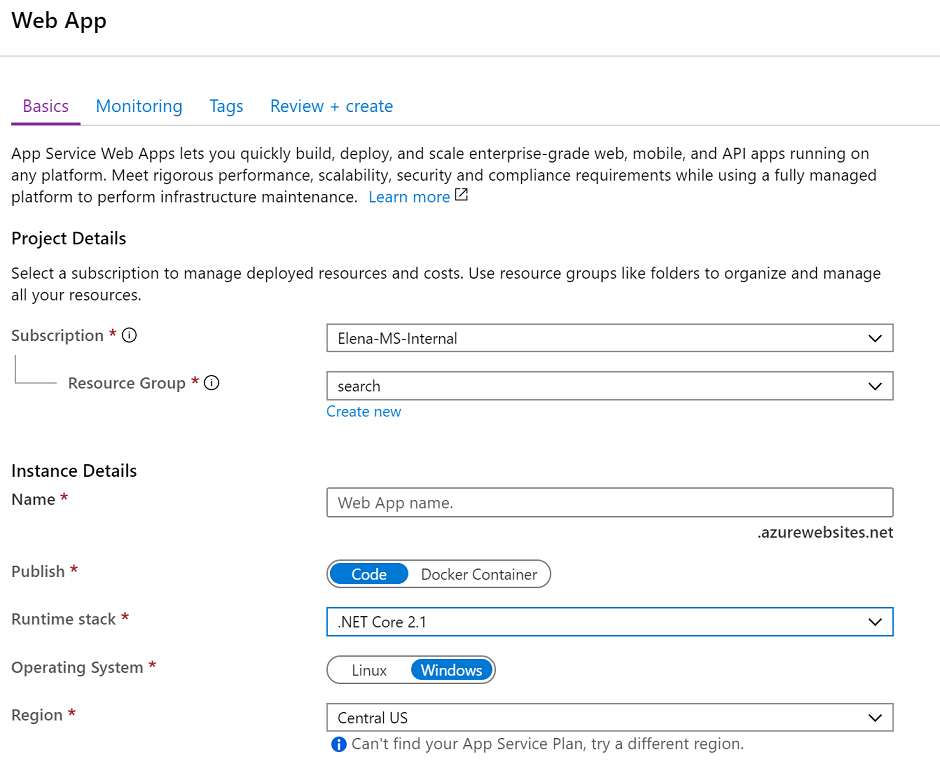
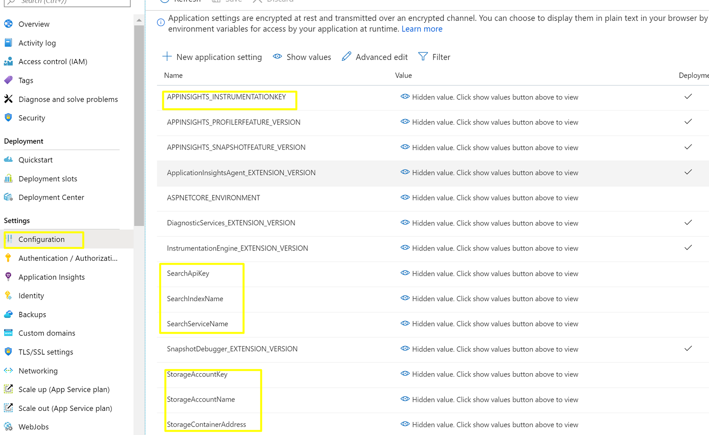
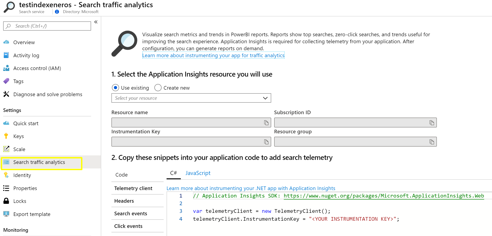
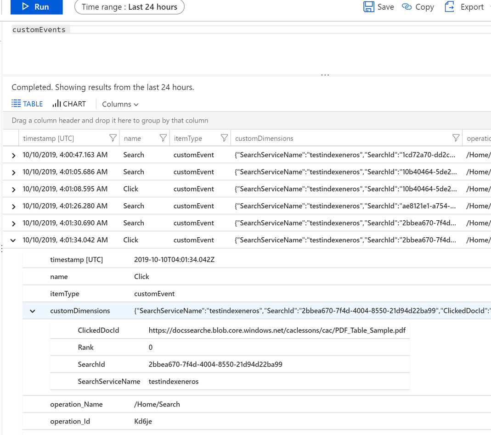
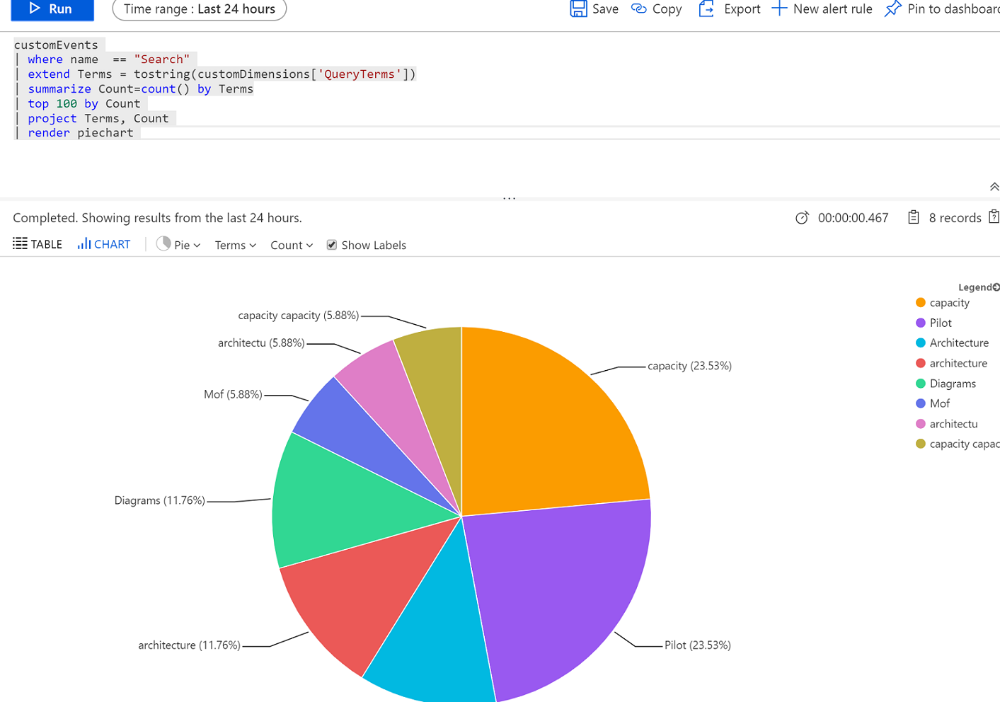

## Search WebApp DotNet 
To provide UI app for the serach use following template [Web UI Template](https://github.com/Azure-Samples/azure-search-knowledge-mining/tree/master/02%20-%20Web%20UI%20Template) and customize it as per the requirements.

Customization steps
- for running locally create `appsettings.Development.json` and add it to `.gitignore`, add settings pointing to index and storage account
```
{
  
  "SearchServiceName": "testindexeneros",
  "SearchApiKey": "",
  "SearchIndexName": "lessons-index",
  "APPINSIGHTS_INSTRUMENTATIONKEY": "",
  "StorageAccountName": "docssearche",
  "StorageAccountKey": "",
  "StorageContainerAddress": "https://docssearche.blob.core.windows.net/caclessons",
  "KeyField": "ID",
  "IsPathBase64Encoded": false,
  "GraphFacet": "keyphrases"
}
```

- Customize `Search/SearchModel.cs` to set fields that will be used for `Facets, Tags and Results` 

```
      private string[] facets = new string[]
        {
            // Add UI facets here in order
            "Project_Name",
            "EventType",
            "Source",
            "Project_Type",
            "LessonDate",
            "keyphrases"
          };

        private string[] tags = new string[]
        {
            "keyphrases"
        };


        private string[] resultFields = new string[]
        {
            // Add fields needed to display results cards

            "metadata_storage_path",
            "ID",
            "content",
            "Project_Name",
            "LessonDate",
            "Source",
            "keyphrases",
            "content_type",
            "EventType",
            "Lessons_Learned_Category"
          };

```

- Customize how search results are presented in `wwwroot/js/results.js` and details in `wwwroot/js/details.js` to retrieve and show metadata fields


## WebApp Hosting
To host webapp use [App Service](https://docs.microsoft.com/en-us/azure/app-service/) service connected with AppInsights.

Use Visual Studio (or CI/CD) to publish the application - for tutorial and steps refer to [Publish a Web app to Azure App Service using Visual Studio](https://docs.microsoft.com/en-us/visualstudio/deployment/quickstart-deploy-to-azure?view=vs-2019)


- Create Azure Web App application (.NET Core 2.1 stack, Windows)


- Set app configuration settings with the same key names as in `appsettings.json`



- Publish Web Application using Visual Studio or CI/CD

## AppInsights Instrumentation

To instrument application with App Insights, take a look at the hints provided in Search service `Search Traffic Analytics` blade



It provides hints on how to connect to AppInsights and send custom `Search` and `Click` events
Out application is already instrumented with AI - the main code resides in `wwwroot/js/appInsights.js` where it  initializes connection
and provides functions to geterate events   `LogSearchAnalytics` and   `LogClickAnalytics` that are used throughout the code.

Note: applicationInstrumentationKey is not hardcoded in the Javascript for security reasons but is provided to JS by backend at runtime.


## AppInsights Query

To see events generated by our Search application, navigate to `App Insights -> Log Analytics blade` and see the events and their custom dimensions would have data that was sent by javascript



Here is example query that would use custom dimensions to get top 100 searched terms

```
customEvents 
| where name  == "Search" 
| extend Terms = tostring(customDimensions['QueryTerms'])
| summarize Count=count() by Terms
| top 100 by Count 
| project Terms, Count 
| render piechart 
```

